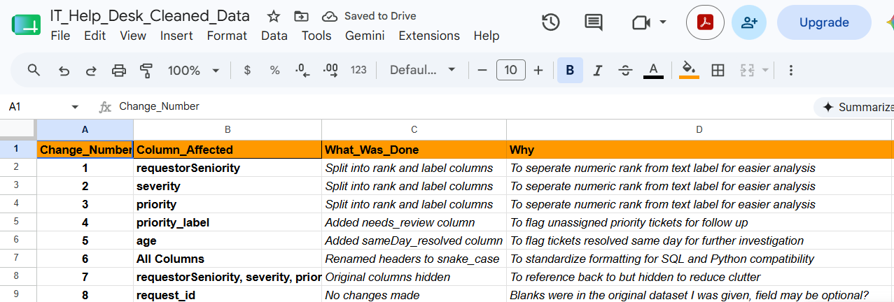
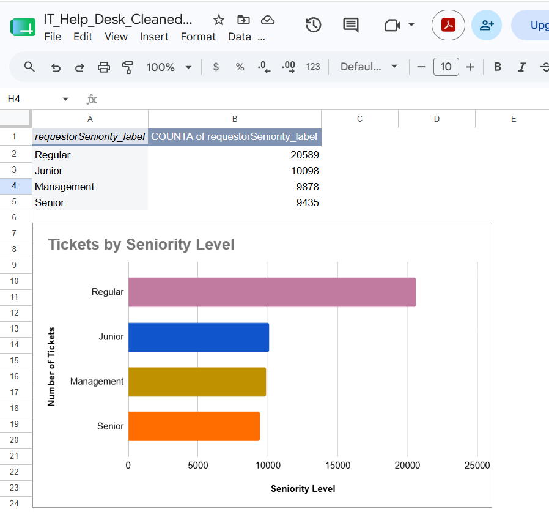
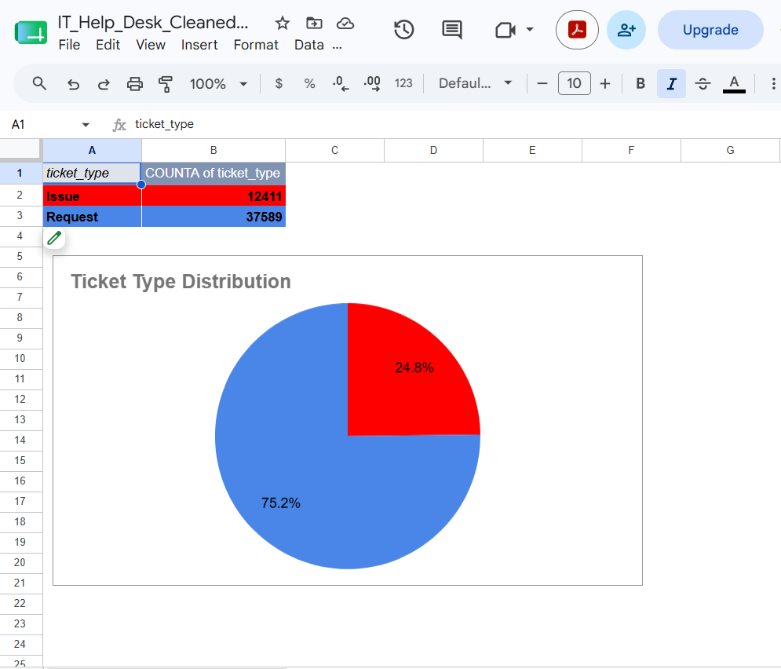

# IT Help Desk Data Analysis

## Overview

Cleaned and analyzed a **50,000-row IT Help Desk dataset** sourced from Kaggle using Google Sheets. The project focuses on data cleaning, documentation, Pivot Table analysis, and identifying operational trends through data visualization.

---

## Project Highlights

### Cleaning Log

The project includes a documented cleaning log that records every transformation made to the dataset and the reason for each change.

### Tickets by Seniority

Example Pivot Table and chart showing ticket distribution by requester seniority.

### Ticket Type Distribution

Analysis of request vs. issue ticket distribution.

---

## Skills Demonstrated

- Microsoft Excel
- Google Sheets
- Pivot Tables
- Data Cleaning
- Data Validation
- Data Quality
- Trend Analysis
- Data Visualization
- Business Reporting
- Technical Documentation

---

## Business Problem

Analyze a 50,000-row IT Help Desk dataset to improve data quality, identify operational trends, and communicate findings through data cleaning, Pivot Tables, charts, and business reporting.

---

## Tools Used

- Google Sheets

---

## Data Cleaning Steps

- Split encoded columns into Rank and Label
- Flagged unassigned priority tickets
- Flagged same day resolved tickets
- Standardized column headers to snake_case
- Documented all changes in a Cleaning Log
- Completed full sanity check

---

## Key Findings

- 75% of tickets are Requests vs 25% Issues
- Systems department generates the most tickets
- 90% of tickets are Normal severity
- Regular employees submit the most tickets at 41%
- Requests take twice as long to resolve as Issues (7.9 days vs 3.7 days).

--- 

## Conclusion

This project demonstrates an end-to-end Excel data analysis workflow, including:

- Data cleaning
- Data validation
- Documentation
- Pivot Table analysis
- Data visualization
- Business insight generation

The analysis identified trends in ticket volume, requester seniority, department workload, and ticket resolution performance.

---

## Files

- 'IT_Help_Desk_Raw_Data.xlsx — original Kaggle dataset
- 'IT_Help_Desk_Cleaned_Data.xlsx — cleaned version
- 'IT_Help_Desk_Analysis.xlsx — pivot tables and charts
